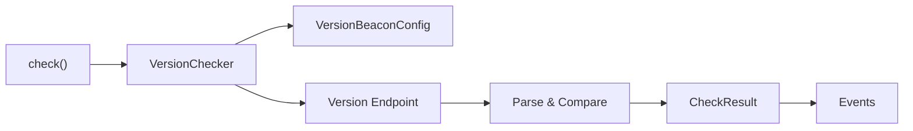

<div align="center">

# ⚡ VersionBeacon

### A lightweight and reliable version checker for Python applications

VersionBeacon helps applications detect available updates through a simple API, environment-based configuration and event callbacks.

<p>
  <a href="https://github.com/Lainupcomputer/VersionBeacon">
    
  </a>
  <a href="#installation">
    
  </a>
  <a href="#events">
    
  </a>
  <a href="https://github.com/Lainupcomputer/VersionBeacon/issues">
    
  </a>
</p>

<p>
  
  
  
  
</p>

</div>

---

## 📖 Contents

* [✨ Features](#-features)
* [🧭 How It Works](#-how-it-works)
* [📦 Installation](#-installation)
* [🚀 Quickstart](#-quickstart)
* [🌱 Environment Configuration](#-environment-configuration)
* [🎯 VersionChecker](#-versionchecker)
* [📡 Events](#-events)
* [📄 Endpoint Format](#-endpoint-format)
* [📊 Results](#-results)
* [🛡️ Error Handling](#️-error-handling)
* [📁 Project Structure](#-project-structure)
* [🧪 Testing](#-testing)
* [📦 Building and Publishing](#-building-and-publishing)
* [🤝 Contributing](#-contributing)
* [📜 License](#-license)

---

## ✨ Features

* Simple one-call API with `check()`
* Reusable `VersionChecker`
* Configuration through Python arguments or environment variables
* Explicit configuration takes precedence over environment variables
* Configurable timeout and retry handling
* Maximum response-size protection
* Structured JSON version responses
* Legacy text response support
* Three- and four-part version comparison
* Event callbacks for every check state
* Structured and typed result objects
* Safe handling of network and response errors
* No runtime dependencies outside the Python standard library
* Python 3.9 and newer
* Ready for PyPI packaging

---

## 🧭 How It Works



VersionBeacon follows a simple process:

1. Load and validate the configuration.
2. Request the configured version endpoint.
3. Parse the remote response.
4. Compare the local and remote versions.
5. Return a structured `CheckResult`.
6. Emit the corresponding events.

---

## 📦 Installation

Install VersionBeacon with pip:

```bash
python -m pip install version-beacon
```

For local development:

```bash
git clone https://github.com/Lainupcomputer/VersionBeacon.git
cd VersionBeacon

python -m venv .venv
python -m pip install -e ".[dev]"
```

### Windows PowerShell

```powershell
python -m venv .venv
.\.venv\Scripts\Activate.ps1
python -m pip install -e ".[dev]"
```

---

## 🚀 Quickstart

```python
from version_beacon import CheckStatus, check

result = check(
    app_name="MyApp",
    current_version="1.2.3",
    version_url="https://example.com/myapp-version.json",
)

if result.status is CheckStatus.UPDATE_AVAILABLE:
    print(f"Update available: {result.latest_version}")
    print(f"Release URL: {result.release_url}")

elif result.status is CheckStatus.UP_TO_DATE:
    print("The application is up to date.")

elif result.status is CheckStatus.CURRENT_AHEAD:
    print("The local version is newer than the remote version.")

elif result.status is CheckStatus.FAILED:
    print(f"Version check failed: {result.error}")
```

---

## 🌱 Environment Configuration

VersionBeacon can load its configuration from environment variables.

The default prefix is:

```text
VERSION_BEACON_
```

| Variable                            | Required | Default            |
| ----------------------------------- | -------- | ------------------ |
| `VERSION_BEACON_APP_NAME`           | Yes      | —                  |
| `VERSION_BEACON_CURRENT_VERSION`    | Yes      | —                  |
| `VERSION_BEACON_VERSION_URL`        | Yes      | —                  |
| `VERSION_BEACON_TIMEOUT`            | No       | `5` seconds        |
| `VERSION_BEACON_RETRIES`            | No       | `0`                |
| `VERSION_BEACON_MAX_RESPONSE_BYTES` | No       | `1048576`          |
| `VERSION_BEACON_USER_AGENT`         | No       | `version-beacon/2` |

### Linux and macOS

```bash
export VERSION_BEACON_APP_NAME="MyApp"
export VERSION_BEACON_CURRENT_VERSION="1.2.3"
export VERSION_BEACON_VERSION_URL="https://example.com/myapp-version.json"
export VERSION_BEACON_TIMEOUT="5"
export VERSION_BEACON_RETRIES="2"
```

### Windows PowerShell

```powershell
$env:VERSION_BEACON_APP_NAME = "MyApp"
$env:VERSION_BEACON_CURRENT_VERSION = "1.2.3"
$env:VERSION_BEACON_VERSION_URL = "https://example.com/myapp-version.json"
$env:VERSION_BEACON_TIMEOUT = "5"
$env:VERSION_BEACON_RETRIES = "2"
```

Once configured, the check only requires:

```python
from version_beacon import check

result = check()
```

---

## ⚙️ Configuration Priority

Configuration values are resolved in this order:

1. Explicit Python arguments
2. Environment variables
3. Built-in defaults

```python
from version_beacon import check

result = check(
    app_name="MyApp",
    current_version="1.2.3",
    version_url="https://example.com/version.json",
    timeout=10,
)
```

The explicit `timeout=10` value takes precedence over `VERSION_BEACON_TIMEOUT`.

A custom environment prefix can be used:

```python
from version_beacon import VersionBeaconConfig

config = VersionBeaconConfig.from_env(
    prefix="MY_APP_VERSION_BEACON_"
)
```

---

## 🎯 VersionChecker

For repeated checks, use `VersionChecker` directly:

```python
from version_beacon import VersionBeaconConfig, VersionChecker

config = VersionBeaconConfig(
    app_name="MyApp",
    current_version="1.2.3",
    version_url="https://example.com/version.json",
    timeout=5,
    retries=2,
)

checker = VersionChecker(config=config)
result = checker.check()

print(result.status)
```

Or load the checker from environment variables:

```python
from version_beacon import VersionChecker

checker = VersionChecker.from_env()
result = checker.check()
```

---

## 📡 Events

VersionBeacon provides events for every important stage of a version check.

| Event              | Payload        |
| ------------------ | -------------- |
| `check_started`    | `CheckStarted` |
| `update_available` | `CheckResult`  |
| `up_to_date`       | `CheckResult`  |
| `current_ahead`    | `CheckResult`  |
| `check_failed`     | `CheckResult`  |
| `check_finished`   | `CheckResult`  |

### Event Callback Example

```python
from version_beacon import EventName, VersionChecker

checker = VersionChecker.from_env()


@checker.on(EventName.UPDATE_AVAILABLE)
def update_available(result):
    print(f"New version available: {result.latest_version}")


@checker.on(EventName.UP_TO_DATE)
def already_current(result):
    print("The application is up to date.")


@checker.on(EventName.CHECK_FAILED)
def check_failed(result):
    print(f"Version check failed: {result.error}")


result = checker.check()
```

Callbacks can be removed again:

```python
checker.off(EventName.UPDATE_AVAILABLE, update_available)
```

Exceptions raised inside callbacks are logged and do not interrupt the version check.

---

## 🧩 One-Call Event Callbacks

The top-level `check()` wrapper also supports direct callback arguments:

```python
from version_beacon import check

result = check(
    on_update_available=lambda result: print(
        f"Update available: {result.latest_version}"
    ),
    on_up_to_date=lambda result: print(
        "Already up to date."
    ),
    on_check_failed=lambda result: print(
        f"Check failed: {result.error}"
    ),
    on_finished=lambda result: print(
        "Check finished."
    ),
)
```

Multiple events can be registered through a mapping:

```python
from version_beacon import EventName, check

result = check(
    events={
        EventName.UPDATE_AVAILABLE: handle_update,
        EventName.CHECK_FAILED: handle_failure,
    }
)
```

---

## 📄 Endpoint Format

The recommended endpoint returns a JSON object:

```json
{
  "app_name": "MyApp",
  "version": "1.2.4",
  "release_url": "https://example.com/releases/1.2.4",
  "release_notes": "Bug fixes and improvements"
}
```

### Required Field

| Field     | Type     | Description              |
| --------- | -------- | ------------------------ |
| `version` | `string` | Latest available version |

### Optional Fields

| Field           | Type     | Description                    |
| --------------- | -------- | ------------------------------ |
| `app_name`      | `string` | Validates the application name |
| `release_url`   | `string` | Link to the release            |
| `release_notes` | `string` | Release notes or changelog     |

The following aliases are supported:

* `application` instead of `app_name`
* `url` instead of `release_url`
* `notes` instead of `release_notes`

---

## 🔁 Legacy Text Responses

For migration compatibility, VersionBeacon also supports the legacy text format:

```text
MyApp_version==1.2.4
```

The application name must match the configured `app_name`.

---

## 🔢 Version Comparison

VersionBeacon supports three- and four-part numeric versions:

```text
1.2.3
1.2.3.4
```

The following versions are treated as equal:

```text
1.2.3 == 1.2.3.0
```

Versions are compared numerically:

```text
2.0.0 > 1.99.99.99
1.2.4 > 1.2.3
```

Supported formats:

```text
MAJOR.MINOR.PATCH
MAJOR.MINOR.PATCH.FIX
```

---

## 📊 Results

Every check returns a `CheckResult` object:

```python
result = checker.check()
```

| Field             | Description                        |
| ----------------- | ---------------------------------- |
| `app_name`        | Configured application name        |
| `current_version` | Installed application version      |
| `latest_version`  | Version reported by the endpoint   |
| `status`          | Current `CheckStatus`              |
| `checked_at`      | Completion timestamp               |
| `version_url`     | Requested endpoint                 |
| `release_url`     | Optional release URL               |
| `release_notes`   | Optional release notes             |
| `error`           | Error message when the check fails |

Convenience properties:

```python
result.update_available
result.up_to_date
result.current_is_ahead
result.failed
```

Possible statuses:

| Status             | Meaning                          |
| ------------------ | -------------------------------- |
| `up_to_date`       | The installed version is current |
| `update_available` | A newer version is available     |
| `current_ahead`    | The local version is newer       |
| `failed`           | The check could not be completed |

---

## 🛡️ Error Handling

Available exception classes:

```python
from version_beacon import (
    ConfigurationError,
    InvalidVersionError,
    VersionBeaconError,
    VersionFetchError,
    VersionResponseError,
)
```

Network and response errors are returned as failed results:

```python
result = checker.check()

if result.failed:
    print(result.error)
```

VersionBeacon includes:

* Configurable request timeouts
* Configurable retries
* Maximum response-size limits
* UTF-8 response validation
* JSON structure validation
* HTTP and HTTPS URL validation
* Numeric version validation

Configuration errors are raised while creating the configuration or checker.

---

## 🏗️ Public API

```python
from version_beacon import (
    check,
    VersionChecker,
    VersionBeaconConfig,
    EventEmitter,
    EventName,
    CheckResult,
    CheckStarted,
    CheckStatus,
    Version,
    parse_version,
)
```

| Component             | Purpose                         |
| --------------------- | ------------------------------- |
| `check()`             | Simple one-call wrapper         |
| `VersionChecker`      | Reusable checker instance       |
| `VersionBeaconConfig` | Validated configuration         |
| `EventEmitter`        | Event registration and dispatch |
| `EventName`           | Available event names           |
| `CheckResult`         | Result of a version check       |
| `CheckStarted`        | Check-start event payload       |
| `CheckStatus`         | Possible check outcomes         |
| `Version`             | Normalized version object       |
| `parse_version()`     | Parse and validate versions     |

---

## 📁 Project Structure

```text
VersionBeacon/
├── examples/
│   └── basic.py
├── scripts/
│   ├── build.ps1
│   └── build.sh
├── src/
│   └── version_beacon/
│       ├── __init__.py
│       ├── client.py
│       ├── config.py
│       ├── events.py
│       ├── exceptions.py
│       ├── models.py
│       └── versions.py
├── tests/
│   ├── test_checker.py
│   └── test_versions.py
├── LICENSE
├── pyproject.toml
└── README.md
```

---

## 🧪 Testing

Run the complete test suite:

```bash
python -m pytest
```

Run tests with verbose output:

```bash
python -m pytest -v
```

Run a specific test file:

```bash
python -m pytest tests/test_checker.py
```

---

## 📦 Building and Publishing

Build source and wheel distributions:

```bash
python -m build
```

Generated packages are placed in:

```text
dist/
```

### Windows

```powershell
.\scripts\build.ps1
```

### Linux and macOS

```bash
./scripts/build.sh
```

Check the generated distributions:

```bash
python -m twine check dist/*
```

Publish to PyPI:

```bash
python -m twine upload dist/*
```

---

## 🧱 Design Goals

VersionBeacon is intentionally focused on a small and reliable API.

The main design goals are:

* Minimal setup for application developers
* No required runtime dependencies
* Safe operation during application startup
* Explicit configuration with environment support
* Predictable result objects
* Clear event lifecycle
* Compatibility with existing version endpoints
* Easy packaging and distribution

---

## 📌 Current Status

* **Version:** `2.0.0`
* **Status:** Beta
* **Python:** `>=3.9`
* **Runtime dependencies:** None
* **License:** MIT

---

## 🤝 Contributing

Contributions, bug reports and suggestions are welcome.

1. Fork the repository.
2. Create a feature branch.
3. Install the development dependencies.
4. Add or update tests.
5. Run the test suite.
6. Open a pull request.

Please keep changes focused and maintain the existing public API style.

---

## 📜 License

VersionBeacon is released under the MIT License.

See [LICENSE](LICENSE) for the complete license text.

---

## 🔗 Repository

<div align="center">

<a href="https://github.com/Lainupcomputer/VersionBeacon">
  
</a>

</div>
